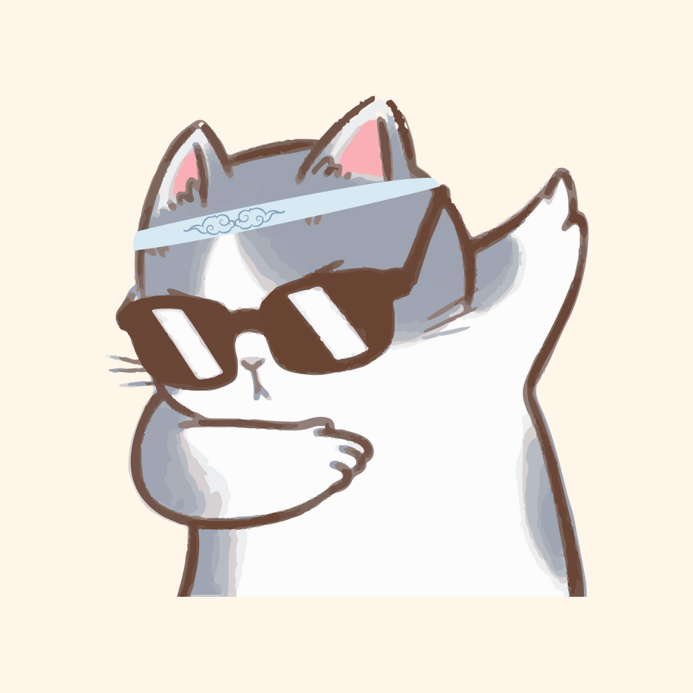

# Readme.md
## 🚀 สมาชิกในกลุ่ม

| ชื่อ - นามสกุล      | รหัสนักศึกษา | Section     | username  |
| :---        |    :----:   |    :----: |   ---:
| Hack      | 643021216-0      |  1  | KanlayaniS |
| Chok   | 123456789-0        | 1      | Chokabcdef|
| Fifa      | 64121334      |  1  | KanlayaniS |
| Kit   | Text        | And more      | |
| Lyon      | 64121334      |  1  | KanlayaniS |
| Pat   | Text        | And more      | |
-- 
## 🚀 สมาชิกในกลุ่ม
  1. สมาชิกคนที่ 1
       - ชื่อ - นามสกุล : กัลยาณี สอนสิงห์
       - รหัสนศ : 643021216-0
       - Section : 1
       - username ของ Github : KanlayaniS
       - 
  2. สมาชิกคนที่ 2
     + ชื่อ - นามสกุล :
     + รหัสนศ :
     + Section : 1
     + username ของ Github :
     + 
  3. สมาชิกคนที่ 3
     + ชื่อ - นามสกุล :
     + รหัสนศ :
     + Section : 1
     + username ของ Github :
     + 
  4. สมาชิกคนที่ 4
     + ชื่อ - นามสกุล :
     + รหัสนศ :
     + Section : 1
     + username ของ Github :
     + 
  5. สมาชิกคนที่ 5
     + ชื่อ - นามสกุล :
     + รหัสนศ :
     + Section : 1
     + username ของ Github :
     + 
  6. สมาชิกคนที่ 6
     + ชื่อ - นามสกุล :
     + รหัสนศ :
     + Section : 1
     + username ของ Github :
     + 

  

  

